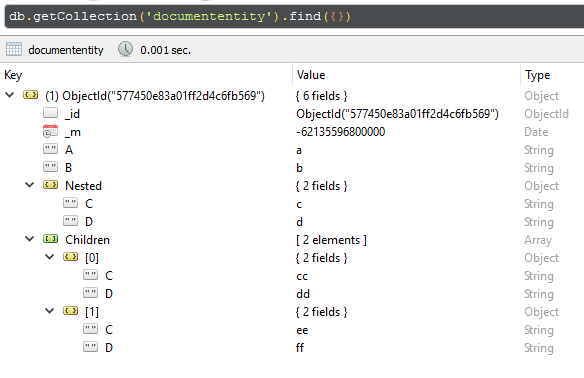
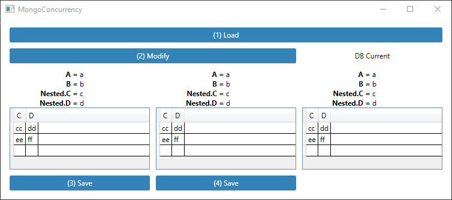
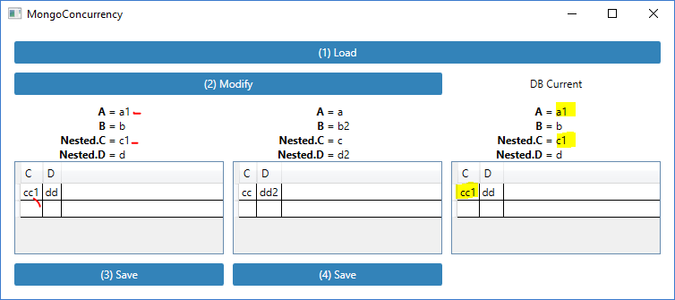
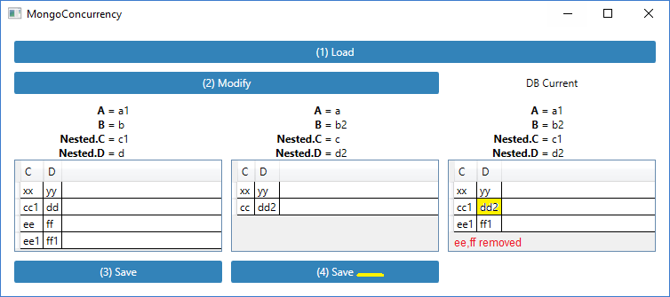

# MongoConcurrency

## Description

Some patterns to allow keep track of changed fields.

## Example db structure



The collection contains DocumentEntity types, which inside contains two simple properties A, B plus one subitem of type NestedDocumentEntity and an Observablecollection of the same type.

## (1) Load

Here the same record of the collection is loaded twice with two separate connections.
First column Entity1 object.
Second column Entity2 object.
Third column after display current db content after each opeation. 



## (2) Modify

```
Entity1.A = a1
Entity1.Nested.C = c1
Entity1.Children.First().C = cc1
Entity1.Children.Add(new { C = ee1, D = ff1 })

Entity2.B = b2
Entity2.Nested.D = d2
Entity2.Children.First().D = dd2
Entity2.Children.Delete: 2th ( C = ee, D = ff )
```

Here intentionally only not overlapped fields are updated, the intent is to see after save of Entity1 and then of Entity2 that last save of Entity2 not write its unmodified fields in order to avoid to overwrite changes done from Entity1 save.


## (3) Save - Entity1

Entity1 saved



## (4) Save - Entity2

Entity2 save



## Pattern rules
- foreach object you want to keep tracking change of fields
    - allocate `_TrackChanges` at constructor time for runtime new objects
    ```csharp
    public NestedDocumentEntity()
    {
        _TrackChanges = new MongoEntityTrackChanges();
    }
    ```

    - implements `IMongoEntityTrackChanges` interface:
    ```csharp
    #region IMongoEntityTrackChanges
    MongoEntityTrackChanges _TrackChanges;       
    public MongoEntityTrackChanges TrackChanges { get { return _TrackChanges; } }        
    #endregion
    ```

    - when not null add the changed property name to the ChangedProperties hashset. In fact this will be null during the loading phase in order to avoid auto-change:
    ```csharp
    TrackChanges?.ChangedProperties.Add("A"); // use of ? operator ( until endinit is null )
    ```

    - implements `ISupportInitialize` interface. This way allow to allocate ChangedProperties hashset to be used when properties will be changed:
    ```csharp
    #region ISupportInitialize
    public void BeginInit()
    {
        _TrackChanges = null;
    }

    public void EndInit()
    {
        _TrackChanges = new MongoEntityTrackChanges();
    }
    #endregion
    ```

    - operations on sets **add**
    ```csharp
    // add item1
    var newItem1 = new NestedDocumentEntity() { C = "ee1", D = "ff1" };
    Entity1.Children.Add(newItem1); // add to OBC
    Entity1.Children.SetAsNew(Entity1, newItem1); // set as added
    ```

    - operations on sets **del**
    ```chsarp
    // del item2
    var oldItem2 = Entity2.Children.Skip(1).First();
    Entity2.Children.Remove(oldItem2); // remove from OBC                
    Entity2.Children.SetAsDeleted(Entity2, oldItem2); // set as deleted 
    ```

    - save changes using `UpdateWithTrack` extension to the entity.
    ```csharp
    Entity1.UpdateWithTrack(repo);
    ```
