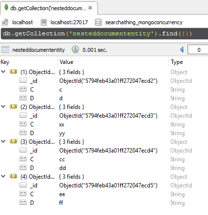
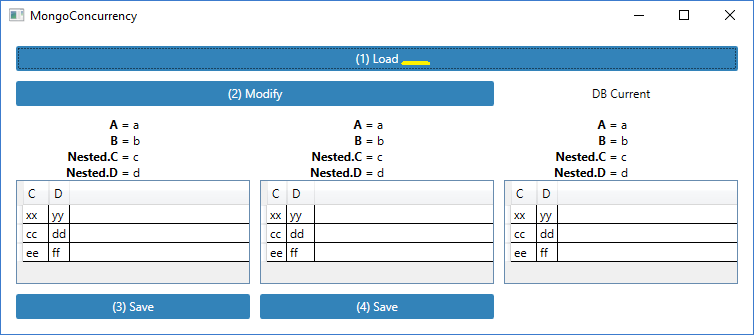
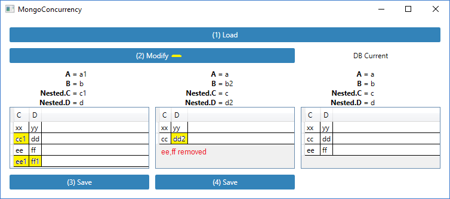
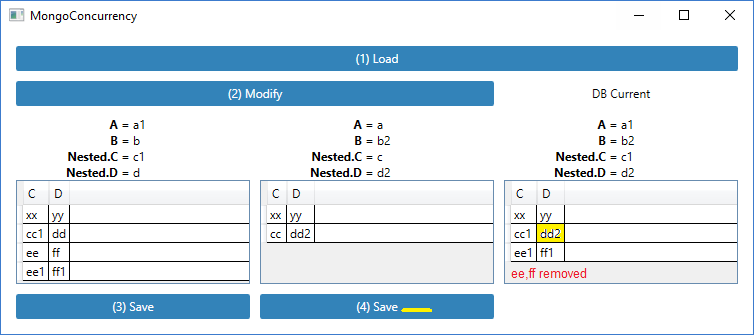

# MongoConcurrency

## Description

Some patterns to allow keep track of changed fields.

## Example db structure

### NestedDocument collection



- first item of the above example is used directly in the DocumentEntity as "Nested" field
- other items are used by the many-to-one relation between DocumentEntity.ChildrenIds and NestedDocuments

### DocumentEntity collection


The collection contains DocumentEntity types, which inside contains two simple properties A, B plus one subitem of type NestedDocumentEntity and an Observablecollection of the same type.

## (1) Load

Here the same record of the collection is loaded twice with two separate connections.
First column Entity1 object.
Second column Entity2 object.
Third column after display current db content after each operation. 



## (2) Modify

```
Entity1.A = a1
Entity1.Nested.C = c1
Entity1.Children.Second().C = cc1
Entity1.Children.Add(new { C = ee1, D = ff1 })

Entity2.B = b2
Entity2.Nested.D = d2
Entity2.Children.Second().D = dd2
Entity2.Children.Delete: 2th ( C = ee, D = ff )
```

Here intentionally only not overlapped fields are updated, the intent is to see after save of Entity1 and then of Entity2 that last save of Entity2 not write its unmodified fields in order to avoid to overwrite changes done from Entity1 save.



## (3) Save - Entity1

Entity1 saved


## (4) Save - Entity2

Entity2 save



## Pattern rules

### Entity types

- Define each entity you want to save in a specific collection inherit from the `SearchAThing.MongoDB.MongoEntity` type. Ths will ensure:
    - an object Id
    - methods extensions ( Delete )
    - event triggering BeforeSave, AfterSave
    - automatic per-field updates

```csharp
public class NestedDocumentEntity : MongoEntity, INotifyPropertyChanged
{
    // ...
}
```

### Many-to-one relation

- Define two properties:
    - a non serializable ObservableCollection to be used as model. Add and removal will be reflected as entity insertion and removal from another collection. Implements only:
        - getter to auto-initialize using MongoContext.LoadOBC method.
    - a serializable `List<string>` to hold ids    

```csharp
#region Children [pc]
ObservableCollection<NestedDocumentEntity> _Children;
[BsonIgnore]
public ObservableCollection<NestedDocumentEntity> Children
{
    get
    {
        if (_Children == null)                
            _Children = MongoContext.LoadOBC<NestedDocumentEntity>(ChildrenIds);                                    

        return _Children;
    }             
}
#endregion

#region ChildrenIds [pc]
List<string> _ChildrenIds;
public List<string> ChildrenIds
{
    get
    {
        if (_ChildrenIds == null) _ChildrenIds = new List<string>();
        return _ChildrenIds;
    }
    set
    {
        if (_ChildrenIds != value)
        {
            _ChildrenIds = value;
            SendPropertyChanged("ChildrenIds");
        }
    }
}
#endregion
```

### Load entities from MongoContext Collection

In order to ensure entities are tracked for their per-field changes when Save, use the `Attach(MongoContext ctx)` extension method before to use entities after any Load operation.

```csharp
Entity1 = ctx1.GetRepository<DocumentEntity>().Collection.AsQueryable().Attach(ctx1).First();
```

### Add new object

In order to ensure entities are tracked for their per-field changes when Save, use the MongoContext.New<T>() or MongoContext.New<T>(T instance) method to create the instance and attach the context.

```csharp
var doc = ctx.New<DocumentEntity>();
doc.A = "a";
doc.B = "b";
``` 

### Drop a collection content

In this case there is no need to attach the entity.

```csharp
var coll = ctx.GetRepository<DocumentEntity>().Collection;
coll.AsQueryable().Foreach(w => ctx.Delete(w));
ctx.Save();
```

### Delete object from an OBC and from DB

- to remove an entity from the OBC simply use the Remove method of the OBC
- if want to remove the entity from their collection too, use the Delete() extension method for any attached entities to remove
- Note: changes will be reflected on Save()

```csharp
var oldItem2 = Entity2.Children.Skip(2).First();
Entity2.Children.Remove(oldItem2); // remove from OBC
oldItem2.Delete(); // db
```

